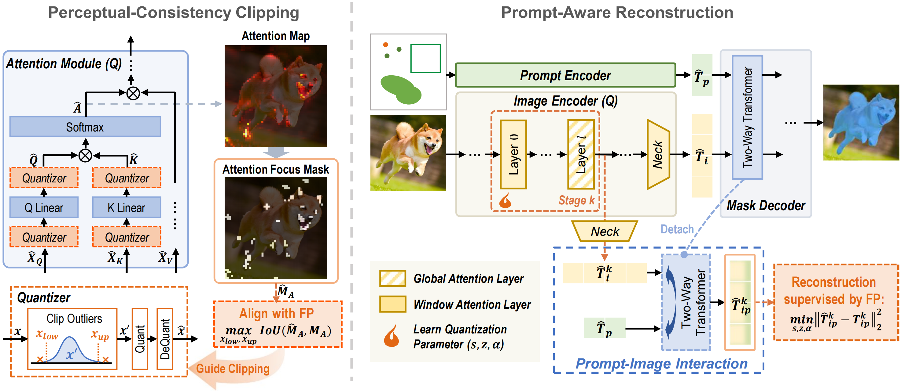

# SAQ-SAM: Semantically-Aligned Quantization for Segment Anything Model

This repository contains the official implementation for the AAAI2026 paper [SAQ-SAM: Semantically-Aligned Quantization for Segment Anything Model](https://arxiv.org/abs/2503.06515)

Jing Zhang, [Zhikai Li✉](https://scholar.google.com/citations?user=XwutB1AAAAAJ&hl=en), [Xuewen Liu](https://scholar.google.com/citations?user=qnklNocAAAAJ&hl=zh-CN&oi=sra), Chengzhi Hu, [Qingyi Gu✉](https://scholar.google.com/citations?user=qnklNocAAAAJ&hl=zh-CN&oi=sra)

(✉ denotes corresponding author.)


## Overview
We propose SAQ-SAM in this paper, which boosts PTQ for SAM from the perspective of semantic alignment.
Specifically, we propose Perceptual-Consistency Clipping, which exploits attention focus overlap to promote aggressive clipping while preserving semantic capabilities. 
Furthermore, we propose Prompt-Aware Reconstruction, which incorporates image-prompt interactions by leveraging cross-attention in mask decoder, thus facilitating alignment in both distribution and semantic. 
Moreover, to ensure the interaction efficiency, we design a layer-skipping strategy for image tokens in encoder.
Extensive experiments are conducted on various SAM sizes and tasks, including instance segmentation, oriented object detection, and semantic segmentation, and the results show that our method consistently exhibits advantages.
For example, when quantizing SAM-B to 4-bit, SAQ-SAM achieves 11.7\% higher mAP than the baseline in instance segmentation task.




## Create Environment
⭐We thank [PTQ4SAM](https://github.com/chengtao-lv/PTQ4SAM?tab=readme-ov-file) for providing reference for environment configuration and data preparation⭐
1. Install PyTorch
```
conda create -n ptq4sam python=3.7 -y
pip install torch torchvision
```

2. Install MMCV

```
pip install -U openmim
mim install "mmcv-full<2.0.0"
```

3. Install other requirements

```
pip install -r requirements.txt
```

4. Compile CUDA operators

```
cd projects/instance_segment_anything/ops
python setup.py build install
cd ../../..
```

5. Install mmdet
```
cd mmdetection/
python3 setup.py build develop
cd ..
```

## Prepare Dataset and Models
Download the official COCO dataset, put them into the corresponding folders of `datasets/` and recollect them as the following form:

```shell
├── data
│   ├── coco
│   │   ├── annotations
│   │   ├── train2017
│   │   ├── val2017
│   │   ├── test2017
```

Download the pretrain weights (SAM and detectors), put them into the corresponding folders of `ckpt/`:

- `sam_b`: [ViT-B SAM](https://dl.fbaipublicfiles.com/segment_anything/sam_vit_b_01ec64.pth)
- `sam_l`: [ViT-L SAM](https://dl.fbaipublicfiles.com/segment_anything/sam_vit_l_0b3195.pth)
- `sam_h`: [ViT-H SAM](https://dl.fbaipublicfiles.com/segment_anything/sam_vit_h_4b8939.pth)
- `faster rcnn`: [R-50-FPN Faster R-CNN](https://download.openxlab.org.cn/models/mmdetection/FasterR-CNN/weight/faster-rcnn_r50_fpn_2x_coco)
- `yolox`: [YOLOX-l](https://download.openmmlab.com/mmdetection/v2.0/yolox/yolox_l_8x8_300e_coco/yolox_l_8x8_300e_coco_20211126_140236-d3bd2b23.pth)
- `detr`: [H-Deformable-DETR](https://github.com/HDETR/H-Deformable-DETR/releases/download/v0.1/r50_hybrid_branch_lambda1_group6_t1500_dp0_mqs_lft_deformable_detr_plus_iterative_bbox_refinement_plus_plus_two_stage_36eps.pth)
- `dino`: [DINO](https://projects4jw.blob.core.windows.net/focalnet/release/detection/focalnet_large_fl4_o365_finetuned_on_coco.pth)

## Usage
To perform quantization on models, specify the model configuration and quantization configuration. For example, to perform W6A6 quantization for SAM-B with a YOLO detector, use the following command:
```shell
# SAQ-SAM*, i.e. without recontruction.
python ptq4sam/solver/test_quant_SAQ_m.py \
--quant-encoder --quant-decoder \
--config='./projects/configs/yolox/yolo_l-sam-vit-b.py' \
--q_config='./exp/config_SA_66.yaml' \
--FFC \
--recon_encoder='no' --recon_decoder='no'

# SAQ-SAM, i.e. with PAR recontruction.
python ptq4sam/solver/test_quant_SAQ_m.py \
--quant-encoder --quant-decoder \
--config='./projects/configs/yolox/yolo_l-sam-vit-b.py' \
--q_config='./exp/config_SA_66.yaml' \
--FFC \
--recon_encoder='CAMS' --recon_decoder='CLM'  --CAM_loss='PAR' 
```
- yolo_l-sam-vit-b.py: configuration file for the SAM-B model with YOLO detector.
- config_SA_66.yaml: configuration file for W6A6 quantization.
- quant-encoder: quant the encoder of SAM.
- quant-decoder: quant the decoder of SAM.
- FFC: apply Perceptual-Consistency Clipping
- recon_encoder: encoder reconstruction method ('CAMS' (ours) or 'ori'(QDrop), or 'no' (not reconstruction))
- recon_decoder: encoder reconstruction method('CLM' (ours) or 'ori'(QDrop), or 'no' (not reconstruction))
- CAM_loss: 'ori' (original reconstruction loss), 'PAR' (our PAR loss)


We recommend using a GPU with more than 40GB for experiments.
If you want to visualize the prediction results, you can achieve this by enabling `--show` and specifying `--show-dir`.
Extreme activation outliers mainly occur in the SAM-B, but PCC also improve performace of SAM-L and SAM-H.


## Bug in baseline Framework
[AGCPTQ](https://github.com/Keio-CSG/AHCPTQ) observe that original PTQ4SAM Framework (our baseline) have a bug: the dropout probability does not revert to 1.0 during the evaluation phase. As a result, half of the activation values remain not quantized. As we apply consistant configuration with PTQ4SAM, our reconstruction results have same issues. This could be fix by add following code:
```shell
for n, m in model.named_modules():
    if hasattr(m, 'drop_prob'):
        m.drop_prob = 1
```
Note that this bug only exists when apply reconstruction, so experimental results without the reconstruction step (PCC only, e.g., SAQ-SAM*)are not affected. 
We will update the repository with the experimental results after fixing the bug as soon as possible.    


## Reference
If you find this repo useful for your research, please consider citing the paper.
```
@article{zhang2025saq,
  title={SAQ-SAM: Semantically-Aligned Quantization for Segment Anything Model},
  author={Zhang, Jing and Li, Zhikai and Gu, Qingyi},
  journal={arXiv preprint arXiv:2503.06515},
  year={2025}
}
```


## Acknowledgments
The code of SAQ-SAM was based on [PTQ4SAM](https://github.com/chengtao-lv/PTQ4SAM), [Prompt-Segment-Anything](https://github.com/RockeyCoss/Prompt-Segment-Anything) and [QDrop](https://github.com/wimh966/QDrop). We thank for their open-sourced code.
